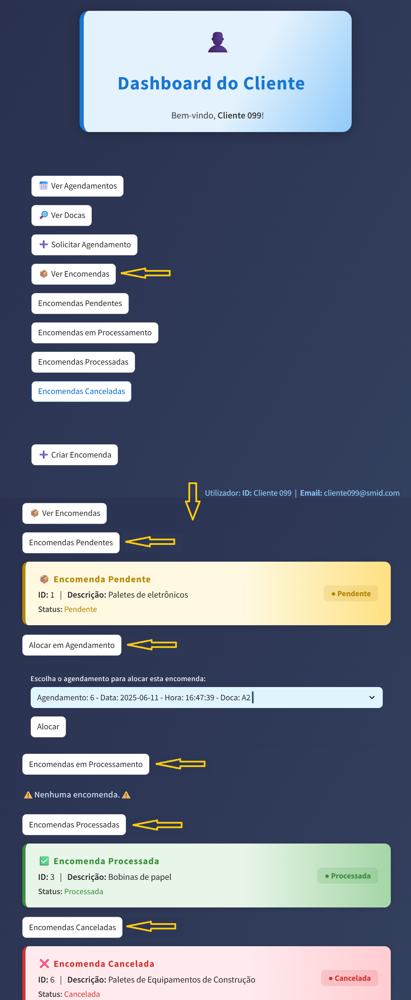
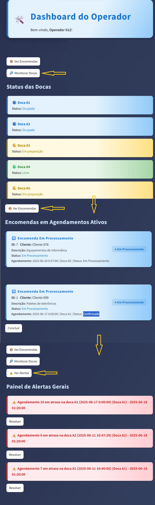

# SMID - Sistema de Monitorização Inteligente de Docas

O **SMID** é uma aplicação desenvolvida com Streamlit para monitorização e gestão de docas logísticas, com foco em eficiência operacional, agendamentos, alertas e relatórios. O sistema adapta os dashboards de acordo com o perfil do utilizador (cliente, operador ou gestor).

## 🧠 Principais funcionalidades

- 🔐 Autenticação por tipo de utilizador
- 📦 Clientes podem criar encomendas e solicitar agendamentos com status pendente
- 🗓️ Gestão de agendamentos e encomendas 📦 (gestor)
- 🚨 Painel de alertas operacionais (operador)
- 📊 Painel estatístico e relatórios (gestor)
- 📈 Painel de eficiência com indicadores logísticos
- 📁 Armazenamento local de dados via MySQL
- 🌐 Acesso remoto via ngrok (opcional)

## 👤 Tipos de Utilizador

| Tipo        | Funcionalidades Principais                                                       |
|-------------|----------------------------------------------------------------------------------|
| **Cliente** | Visualiza sua doca, solicita agendamentos, cria encomendas, e consulta histórico |
| **Operador**| Visualiza alertas em tempo real e tarefas da(s) doca(s) designada(s)             |
| **Gestor**  | Acesso completo a dashboards, relatórios e dados consolidados                    |

## 🗂️ Estrutura de pastas

SMID/

├── app.py # Arquivo principal da aplicação

├── dashboards/ # Dashboards por tipo de utilizador

│ ├── cliente.py # Inclui criação de encomendas

│ ├── operador.py

│ ├── gestor.py

│ ├── painel_agendamentos.py

│ ├── painel_alertas.py

│ ├── painel_eficiencia.py

│ ├── painel_estatisticas.py

│ └── painel_relatorios.py

├── database/db.py # Conexão e funções com SQLite

├── utils/

│ ├── auth.py # Sistema de login

│ ├── dados.py # Manipulação de dados

│ ├── enums.py # Enumerações

│ └── ___init___.py

├── data/seed_usuarios.csv # Arquivo com utilizadores de teste

├── .streamlit/config.toml # Personalização visual do app

├── ngrok.exe # (opcional) túnel para acesso externo

└── requirements.txt #

## 📸 Capturas de tela (exemplos)

- **Tela de Login:**  
  

- **Dashboard do Cliente (encomendas):**  
  

- **Dashboard do Operador (Docas, encomendas e alertas):**  
  

- **Dashboard do Gestor (Agendamentos e KPI's/Relatórios):**  
  

## 🚀 Como executar

1. Clone o repositório:

git clone https://github.com/Paulo-DeLima/SMID.git
cd SMID

2. Instale as dependências:

pip install -r requirements.txt

Execute a aplicação:

streamlit run app.py

(Opcional) Para acesso remoto, execute o ngrok:

ngrok http 8501

🔐 Login de Teste:

*Utilizadores de exemplo estão em data/seed_usuarios.csv.*

Exemplo:

Utilizador: operador012@smid.com
Senha: 1234

Use conforme os dados definidos no seu banco/CSV.

🛠 Tecnologias utilizadas:

Python 3.10+

Streamlit

MySQL

Ngrok (opcional)

📌 Sobre o Projeto
Este sistema foi desenvolvido como parte prática do curso de Redes e Segurança Informática, visando a simulação de um ambiente real de gestão logística com foco em monitoramento, eficiência e controlo de acessos.

📃 Licença
Este projeto está sob a licença MIT. Veja o arquivo LICENSE para mais detalhes.
