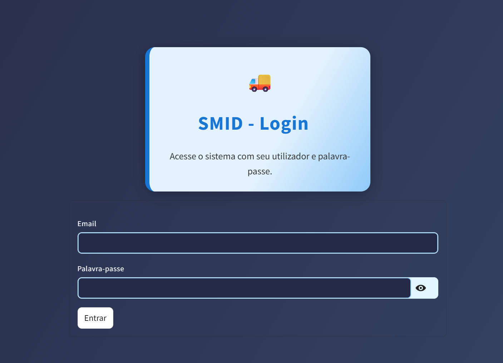

# SMID - Sistema de Monitorização e Integração de Docas

O **SMID** é uma aplicação desenvolvida com Streamlit para monitorização e gestão de docas logísticas, com foco em eficiência operacional, agendamentos, alertas e relatórios. O sistema adapta os dashboards de acordo com o perfil do utilizador (cliente, operador ou gestor).

## 🧠 Principais funcionalidades

- 🔐 Autenticação por tipo de utilizador
- 📦 Clientes podem **criar encomendas** com status pendente
- 🗓️ Gestão de agendamentos (cliente)
- 🚨 Painel de alertas operacionais (operador)
- 📊 Painel estatístico e relatórios (gestor)
- 📈 Painel de eficiência com indicadores logísticos
- 📁 Armazenamento local de dados via CSV e SQLite
- 🌐 Acesso remoto via ngrok (opcional)

## 👤 Tipos de Utilizador

| Tipo        | Funcionalidades Principais                                                 |
|-------------|----------------------------------------------------------------------------|
| **Cliente** | Visualiza sua doca, agendamentos, **cria encomendas**, e consulta histórico |
| **Operador**| Visualiza alertas em tempo real e tarefas da(s) doca(s) designada(s)        |
| **Gestor**  | Acesso completo a dashboards, relatórios e dados consolidados              |

## 🗂️ Estrutura de pastas

SMID/
├── app.py # Arquivo principal da aplicação
├── dashboards/ # Dashboards por tipo de utilizador
│ ├── cliente.py # Inclui criação de encomendas
│ ├── operador.py
│ ├── gestor.py
│ ├── painel_agendamentos.py
│ ├── painel_alertas.py
│ ├── painel_eficiencia.py
│ ├── painel_estatisticas.py
│ └── painel_relatorios.py
├── database/db.py # Conexão e funções com SQLite
├── utils/
│ ├── auth.py # Sistema de login
│ ├── dados.py # Manipulação de dados
│ ├── enums.py # Enumerações
│ └── init.py
├── data/seed_usuarios.csv # Arquivo com utilizadores de teste
├── .streamlit/config.toml # Personalização visual do app
├── ngrok.exe # (opcional) túnel para acesso externo
└── requirements.txt #

## 📸 Capturas de tela (exemplos)

> Substitua os arquivos abaixo após adicionar os prints à pasta `/screenshots`.

- **Tela de Login**  
  

- **Dashboard do Cliente (com encomendas)**  
  

- **Dashboard do Operador (alertas)**  
  

- **Dashboard do Gestor (Agendamentos e KPI's/Relatórios)**  
  

- **Painel de Eficiência (gráficos/KPIs)**  
  

## 🚀 Como executar

1. Clone o repositório:

```bash
git clone https://github.com/Paulo-DeLima/SMID.git
cd SMID
Instale as dependências:

bash
Copiar
Editar
pip install -r requirements.txt
Se requirements.txt não existir, gere com pip freeze > requirements.txt

Execute a aplicação:

bash
Copiar
Editar
streamlit run app.py
(Opcional) Para acesso remoto, execute o ngrok:

bash
Copiar
Editar
ngrok http 8501
🔐 Login de Teste
Utilizadores de exemplo estão em data/seed_usuarios.csv.
Exemplo:

Utilizador: cliente1

Senha: 1234

Use conforme os dados definidos no seu banco/CSV.

🛠 Tecnologias utilizadas
Python 3.10+

Streamlit

SQLite3

Ngrok (opcional)

📌 Sobre o Projeto
Este sistema foi desenvolvido como parte prática do curso de Redes e Segurança Informática, visando a simulação de um ambiente real de gestão logística com foco em monitoramento, eficiência e controlo de acessos.

📃 Licença
Este projeto está sob a licença MIT. Veja o arquivo LICENSE para mais detalhes.
